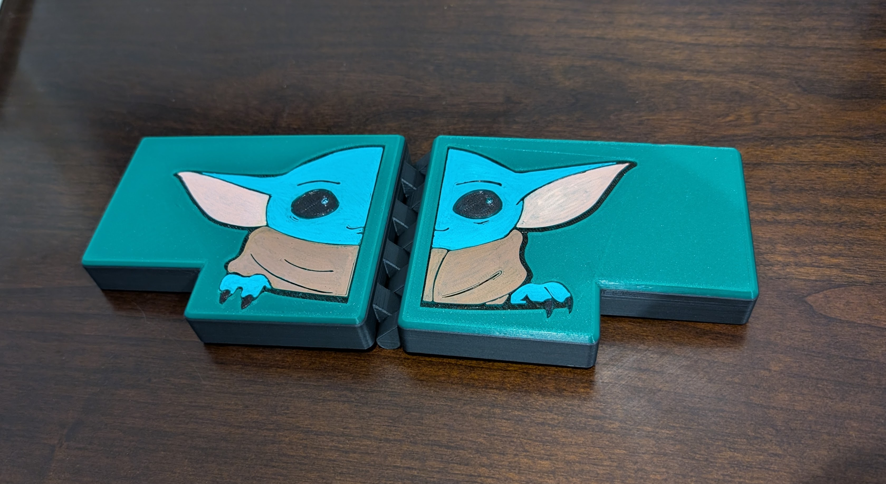
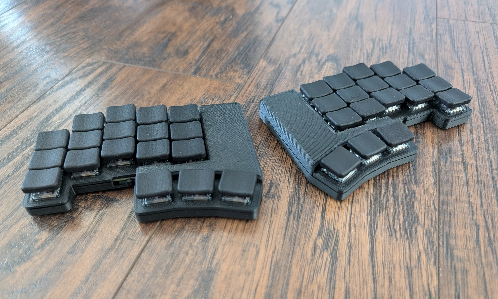

# bykeeb (baby yoda keyboard)

## overview
bykeeb stands for "Baby Yoda Keyboard"

This is a 36 key wireless keyboard using a seeed xiao nrf52840 controller, supporting choc, gateron low profile, and MX switches.

### key features
* 36 keys
* seeed xiao nrf52840 controller
* hotswap or direct solder support for choc, gateron low profile, and MX switches
* battery cutout in pcb for a 32mm x 20mm x 6mm battery
* battery through holes for soldering a JST connector or direct wire
* on/off switch
* reset switch

### important notes
* This keyboard is wireless only. You cannot use a xiao rp2040.
* The switch spacing on this board is what I call min-y standard-x spacing. This is 19mm x 16mm. In the pictures above, I'm using [CMY keycaps](https://github.com/sadekbaroudi/fingerpunch/tree/master/keycaps/CMY).

## firmware

Firmware is done in [ZMK](https://zmk.dev/), and can be found in the [zmk-fingerpunch-keyboards](https://github.com/sadekbaroudi/zmk-fingerpunch-keyboards) github repository, specifically in the `boards/shields/bykeeb` directory.

## build guide

see the [build guide](buildguide/README.md) for more info

## case

see the [case readme](cases/README.md) for more info

## fabrication

Use the `gerber.zip` found in the [pcb directory](pcb/mx-choc-ks-27/production). If you are using [jlcpcb](jlcpcb.com), you can also use the `bom.csv` and `positions.csv` to do PCBA

## LICENSE

Free to use for personal use only. Any derivitive work must reference the author by name, link to [https://github.com/sadekbaroudi/bykeeb](https://github.com/sadekbaroudi/bykeeb), and propagate this license text. No commercial use of this work or any of its derivatives.

THE CONTENT OF THIS REPOSITORY IS PROVIDED "AS IS", WITHOUT WARRANTY OF ANY KIND, EXPRESS OR IMPLIED, INCLUDING BUT NOT LIMITED TO THE WARRANTIES OF MERCHANTABILITY, FITNESS FOR A PARTICULAR PURPOSE AND NONINFRINGEMENT. IN NO EVENT SHALL THE AUTHORS OR COPYRIGHT HOLDERS BE LIABLE FOR ANY CLAIM, DAMAGES OR OTHER LIABILITY, WHETHER IN AN ACTION OF CONTRACT, TORT OR OTHERWISE, ARISING FROM, OUT OF OR IN CONNECTION WITH THE SOFTWARE/HARDWARE OR THE USE OR OTHER DEALINGS IN THE SOFTWARE/HARDWARE.
