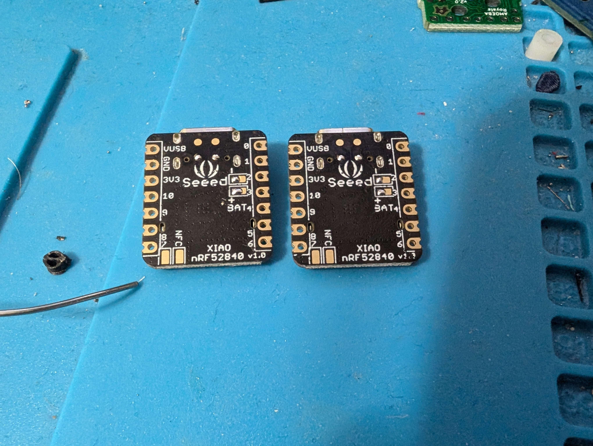
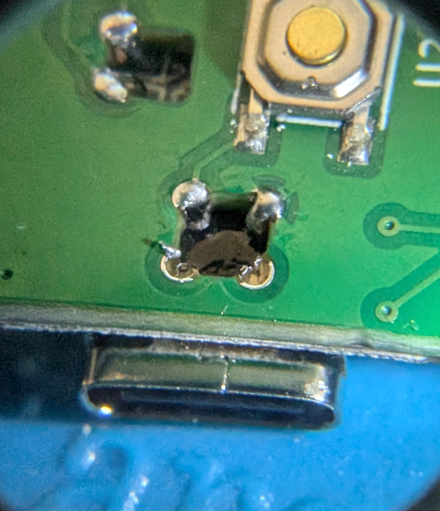
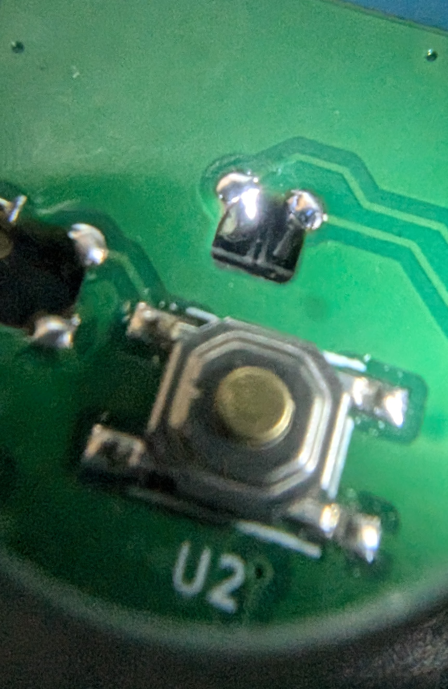
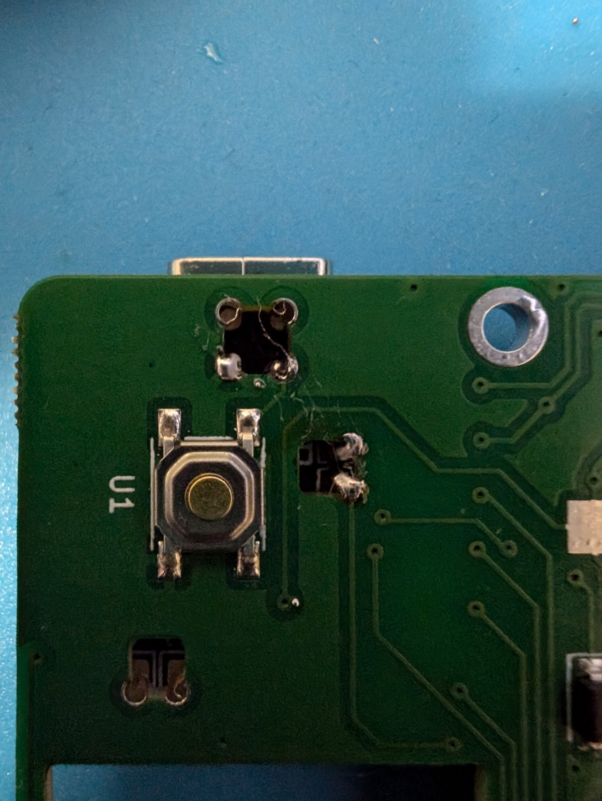
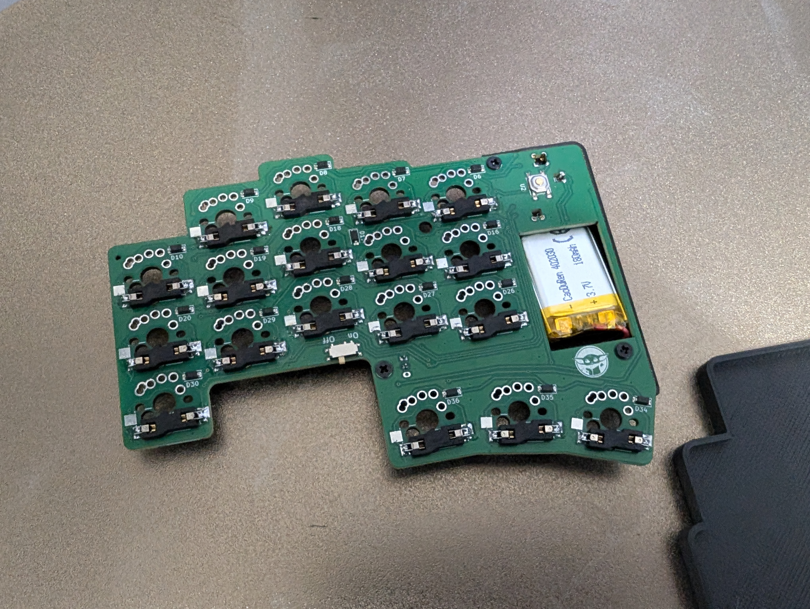
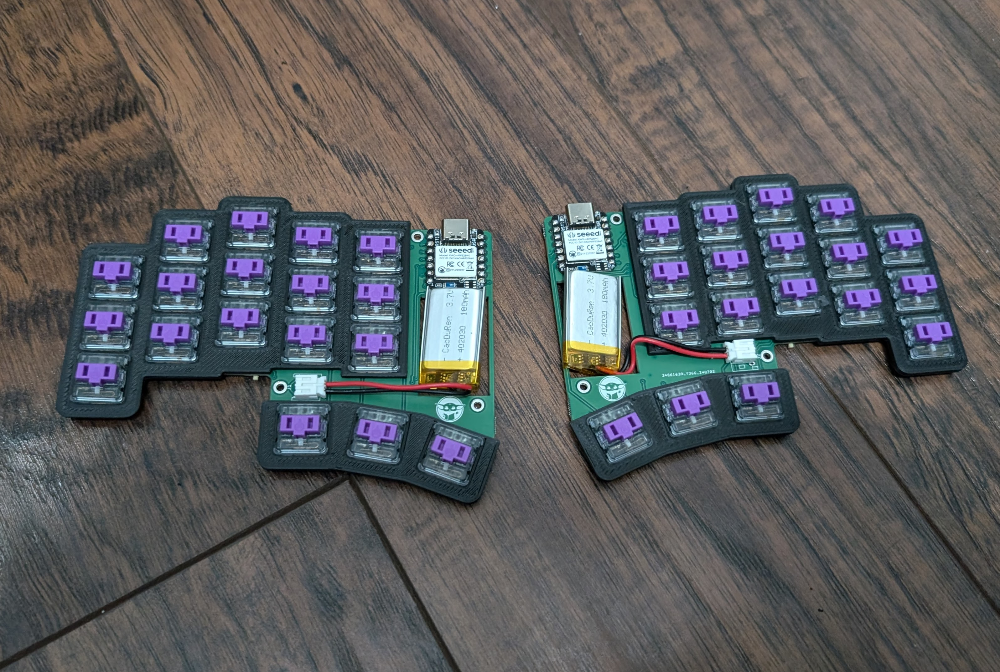
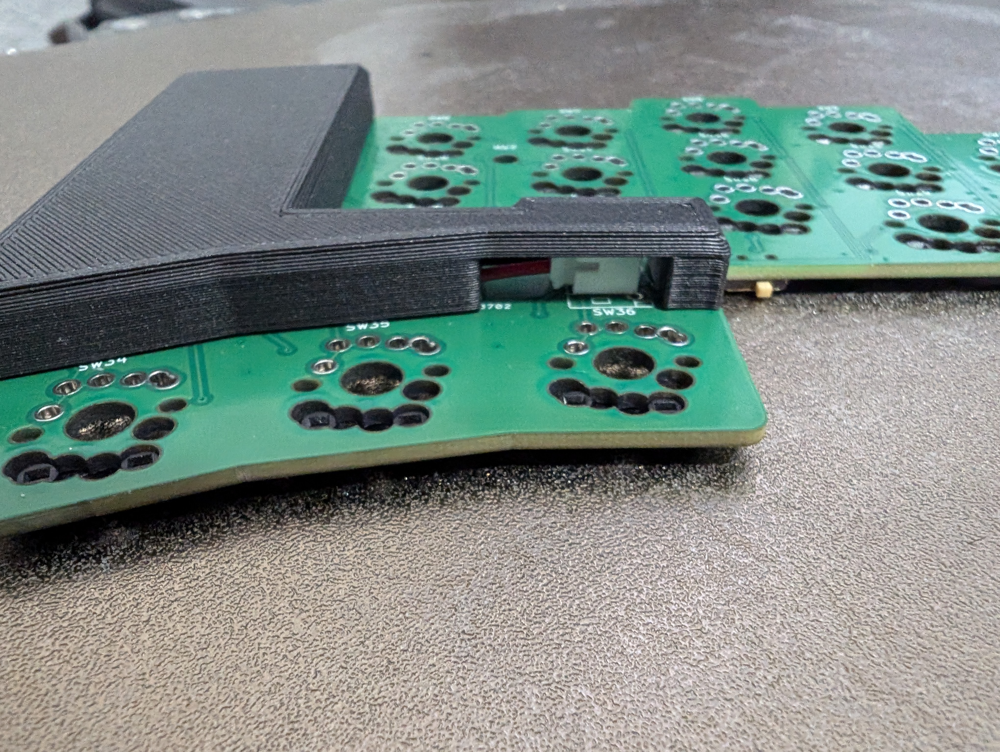

# build guide

## steps

(Note that there are additional images at the bottom of this guide as references for the build process)

1. Solder all the diodes. The line marking on the diode should be on the side closer to the diode silkscreen with a vertical line closing off the two horizontal lines
2. Solder the reset switch. The orientation doesn't matter
3. Solder the on/off switch. There is only one orientation for this. After soldering, **make sure the switch is in the off position**.
4. If using hotswap, solder all the hotswap sockets
5. Pre-solder the pads on the xiao controller, as shown below. For the battery pads, try to get only half the pad. If you get the right half covered in solder, the xiao pcb won't sit flush on the bykeeb pcb.

6. After soldering all the castellated pads of the xiao to the top side of the bykeeb, flip the board over and solder the through holes. The reason that wetting the pads in step 5 was important is that now you can pull the solder up with the soldering iron to make a good connection. See below.

7. If you're building without hotswap sockets, place the switches into the through holes, and solder them. Please note that if you want to use switch plates, you **must** have them in place before this step, or you won't be able to add them later.
8. Solder the JST connector to the top sides of the bykeeb halves. It is very important that you know the polarity of your battery before soldering this. You can plug in the battery into the JST connector before soldering. The through holes on the outside are the B- (ground) connections, and the single center through hole is the B+ (VCC). So, the red wire of the battery should go to the center through hole (B+).

You're done assembling the PCB!

## images

