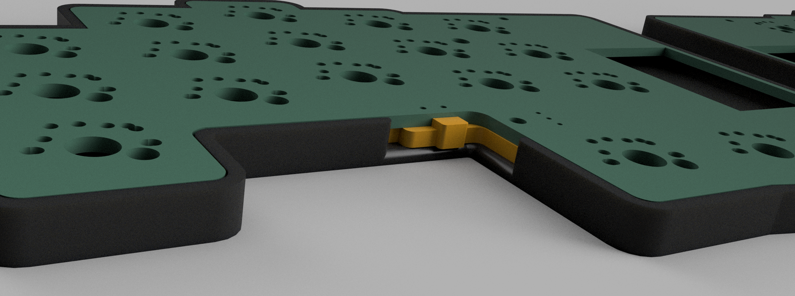

# bykeeb case

## parts

For this build, you'll need:
| Required or Optional     | Quantity | Part                                                                | Notes                                                        |                       
| ------------------------ | -------- | ------------------------------------------------------------------- | ------------------------------------------------------------ |
| Required                 | 1        | left body                                                           |                                                              |
| Required                 | 1        | right body                                                          |                                                              |
| Optional                 | 1        | left cover                                                          |                                                              |
| Optional                 | 1        | right cover                                                         |                                                              |
| See notes                | 1        | left switch plates                                                  | Only optional for for choc / glp, required for MX            |
| See notes                | 1        | right switch plates                                                 | Only optional for for choc / glp, required for MX            |
| See notes                | 6        | M2 heat set inserts, 3.5mm diameter, 3.5-4mm length                 | Only required if you are using the left and right covers     |
| See notes                | 6        | M2 screws, 5mm                                                      | Only required if you are using the left and right covers     |
| Optional                 | 1        | left on/off switch cover                                            |                                                              |
| Optional                 | 1        | right on/off switch cover                                           |                                                              |

### explanation of file names

* `bykeeb-on-off-switch-long` vs `bykeeb-on-off-switch-short` - the long will not fit in the carrying case, but is more convenient to switch on and off. The short one will fit in the carrying case
* `bykeeb-body-left-inset-0.2mm` - The `inset-0.2mm` models go in 0.2mm in the inside perimeter of the body. It's a bit of a tighter fit for the pcb. This is in case the pcb doesn't snap fit into the body well enough for the non-inset version.

## renders

## assembly

The pcb is a press fit into the body.

For the cover, you should melt the heat set inserts into the mounting points, and then screw into the heat set inserts from the bottom of the pcb.
